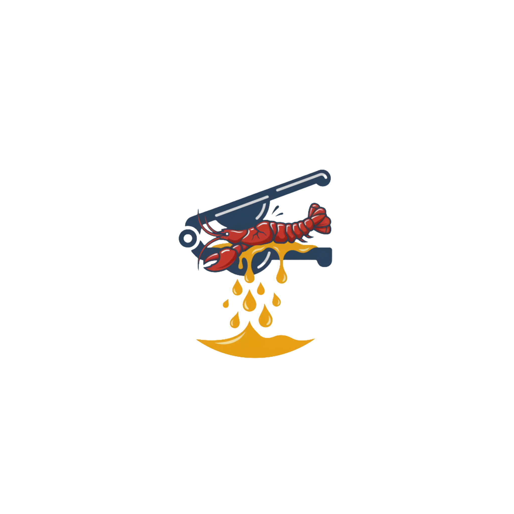

<p align="center">
  
</p>

<h1 align="center">🍋 ClawSqueezer</h1>

<p align="center">
  <strong>Stale content eviction for <a href="https://github.com/openclaw/openclaw">OpenClaw</a></strong>
</p>

<p align="center">
  <a href="https://www.npmjs.com/package/@cldy-com/clawsqueezer"></a>
  <a href="https://github.com/cldy-com/ClawSqueezer/blob/main/LICENSE"></a>
  <a href="https://github.com/openclaw/openclaw"></a>
</p>

<p align="center">
  <a href="./README.md">English</a> | <a href="./README_CN.md">中文</a>
</p>

Your messages are 3% of context. Images, tool results, and exec outputs are 86%. After the LLM has processed them, they're dead weight — but they stay in context until compaction fires.

ClawSqueezer evicts stale heavy content before each LLM call. Compaction fires 2-3x less often.

## The Problem

Real OpenClaw session breakdown (analyzed from production data):

```
📄 Tool results (160)    65,000 tokens   42%  ← File reads, exec outputs, web fetches
📸 Image (1 screenshot)  48,000 tokens   30%  ← ONE base64 image
🔧 Tool call args (160)  18,000 tokens   12%  ← SSH commands, file paths, arguments
🤖 Assistant text (128)  18,000 tokens   11%  ← LLM responses
💬 User messages (75)     4,000 tokens    3%  ← Your actual words
🔩 Overhead               4,000 tokens    2%  ← Tool IDs, thinking
──────────────────────────────────────────────
                        ~157K tokens filling a 200K context window
```

That image was seen 20 turns ago. Those file reads were processed and acted upon. But they're still sitting in context, eating tokens, until compaction triggers an expensive LLM call to summarize everything.

## The Solution

`assemble()` runs before every LLM call and evicts stale content:

```
Image (48K tokens, 5 turns old)
  → "[image was here — 48,000 tokens, processed 5 turns ago]"
  → 48K tokens freed

File read (10K tokens, 8 turns old)  
  → "[tool result squeezed — was 40,000 chars — Preview: import { Router }...]"
  → 9.5K tokens freed

Exec output (5K tokens, 6 turns old)
  → "[exec: npm run build 2>&1]"
  → 5K tokens freed
```

Recent content is never touched. Only stale heavy blocks get squeezed.

## Requirements

- **OpenClaw >= 2026.3.7** (ContextEngine plugin slot)
- **Node.js >= 20**

The plugin checks the OpenClaw version at startup and disables itself if the version is too old.

## Installation

```bash
# From npm
openclaw plugins install @cldy-com/clawsqueezer

# From GitHub
openclaw plugins install https://github.com/cldy-com/ClawSqueezer

# From local path (for development)
openclaw plugins install /path/to/ClawSqueezer --link
```

Then activate it as the context engine:

```bash
openclaw config set plugins.slots.contextEngine clawsqueezer
```

Or in `openclaw.json`:

```json
{
  "plugins": {
    "slots": {
      "contextEngine": "clawsqueezer"
    }
  }
}
```

### Configuration

```json
{
  "plugins": {
    "config": {
      "clawsqueezer": {
        "staleTurns": 4,
        "minTokensToSqueeze": 200,
        "keepPreviewChars": 200,
        "imageAgeTurns": 2
      }
    }
  }
}
```

| Option | Default | Description |
|--------|---------|-------------|
| `staleTurns` | `4` | Turns before content is eligible for eviction |
| `minTokensToSqueeze` | `200` | Minimum token size to consider evicting |
| `keepPreviewChars` | `200` | Characters of preview to keep from evicted content |
| `imageAgeTurns` | `2` | Turns before images are evicted (lower = more aggressive) |

### Rollback

If anything goes wrong, rollback is instant:

```bash
# Soft — back to default, plugin stays installed
openclaw config unset plugins.slots.contextEngine

# Medium — plugin won't load
openclaw plugins disable clawsqueezer

# Hard — completely gone
openclaw plugins uninstall clawsqueezer
```

No data loss. ClawSqueezer only modifies messages in memory during `assemble()` — it never writes to session files.

## How It Works

```
Message arrives → OpenClaw processes normally
                         │
                         ▼
                  assemble() fires before LLM call
                         │
                         ▼
              ┌──────────────────────┐
              │ Scan messages for:   │
              │ • Images > N turns   │
              │ • Tool results > N   │
              │ • Exec outputs > N   │
              │ • Large tool args    │
              └──────────┬───────────┘
                         │
              Replace with tiny placeholders
                         │
                         ▼
              LLM sees lean context → more room for work
              Compaction fires less often → saves money
```

### What Gets Squeezed

| Content Type | Typical Size | After Squeeze | When |
|-------------|-------------|--------------|------|
| Base64 image | 48,000 tokens | ~20 tokens | After 2 turns |
| Tool result (file read, exec output) | 2,000–10,000 tokens | ~50 tokens | After 4 turns |
| Tool result (web fetch) | 1,000–5,000 tokens | ~30 tokens | After 4 turns |
| Tool call arguments | 200–2,000 tokens | ~20 tokens | After 4 turns |

### What's Never Touched

- Recent messages (within `staleTurns`)
- User text messages (always small)
- Assistant text responses (the actual conversation)
- Thinking blocks
- Small tool results (below `minTokensToSqueeze`)
- Tool call structure (type, id, name preserved for API pairing)

### Production Results

First production deployment:

```
Before ClawSqueezer:   Context fills to 180K → compaction fires
After ClawSqueezer:    73 blocks evicted, ~96K tokens freed per call
                       Image: 11K freed | Tool results: 85K freed
```

## Standalone Usage

```typescript
import { squeeze } from "@cldy-com/clawsqueezer";

const { messages: squeezed, stats } = squeeze(messages, {
  staleTurns: 4,
  imageAgeTurns: 2,
});

console.log(`Freed ${stats.tokensFreed} tokens`);
console.log(`Evicted: ${stats.imagesEvicted} images, ${stats.toolResultsEvicted} tool results`);
```

## Why Not Just Compress The Summary?

We tried that first. It works (55% smaller summaries), but the real waste isn't in the summary — it's in the 86% of context that's stale images and tool outputs. Compressing the summary saves 3K tokens. Evicting one old screenshot saves 48K.

## License

Apache-2.0 — Built by [CLDY](https://cldy.com)
